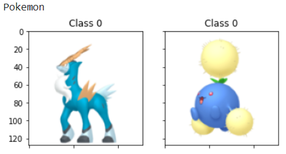
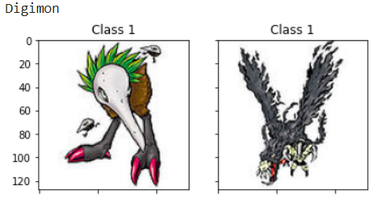
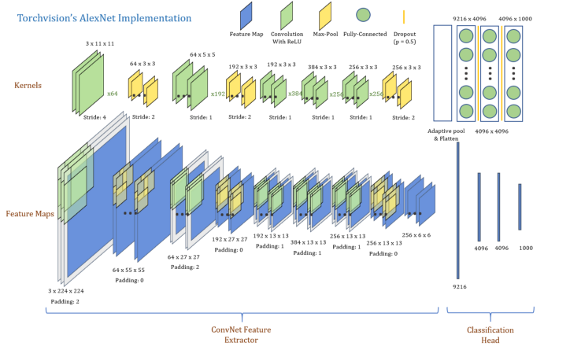
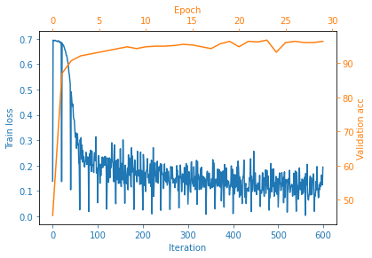
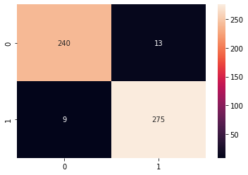
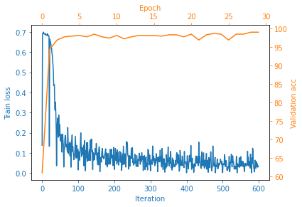
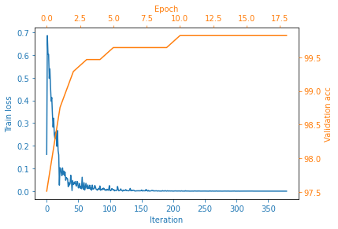

# Pokemon2Digimon
### Autor: Juan Manuel Camara Diaz
### DATASET: PokemonAndDigimon https://www.kaggle.com/juanmacd/pokemonshinydigimon
### URL: Pokemon (recoleccion propia) Digimon https://github.com/DeathReaper0965/Digimon-Generator-GAN/blob/master/Digimon.zip

## :page_with_curl: Resumen

En este repositorio puedes encontrar un analisis de diferentes clasificadores de Pokemons y Digimons. Los modelos analizados son VGG16 y Alexnet. En el fichero `notebook.ipynb` puedes encontrar todo lo necesario.
  
## :black_nib: Requisitos/Demo

Para instalar todo lo necesario utilizamos el comando:

    pip install -r requirements.txt

Una vez instalado todo lo necesario, podemos ejecutar el notebook con el comando:

    jupyter notebook notebook.ipynb

Ya esta preparado para que se pueda ejecutar celda por celda.

## :flower_playing_cards: Dataset

Un ejemplo del dataset es el siguiente, Pokemon clase 0 y Digimon clase 1:

  

Como preprocesado del dataset (solo para el train/validation) se ha aplicado una normalizacion de pixeles, un volteado horizontal, un volteado vertical y ambos. Nos queda las siguientes dimensiones:

- Datos de entreamiento: 3200
- Datos de validacion: 576
- Datos de test: 537

## :chart_with_upwards_trend: Modelos

Se han realizado varios entrenamiento de modelos:

### Alexnet

Se ha modificado el modelo, cambiando la ultima capa de salida a una capa de salida de 2 neuronas. Como input se ha utilizado una imagen de 128x128.

  

El modelo ha obtenido un accuracy del 96% con los datos de test.

### VGG16

Se ha modificado el modelo, cambiando la ultima capa de salida a una capa de salida de 2 neuronas. Como input se ha utilizado una imagen de 128x128.

  

El modelo ha obtenido un accuracy del 99% con los datos de test.

### VGG16 Pretrained

Se ha utilizado el modelo pre-entrenado que ofrece Pytorch de VGG16.

  

El modelo ha obtenido un accuracy mas del 99% con los datos de test.

## :computer: Modelos entrenados

Los modelos pre-entrenados realizados en el notebook lo encontramos en el siguiente enlace:

    https://drive.google.com/drive/folders/15DeTgW71LuhhHLrUD5slMvnr_-Kdi12i?usp=sharing    

Una vez descargados poner los modelos dentro de la carpeta models.

## :tada: Resultados

A lo largo del notebook he entrenado dos modelos distintos, Alexnet y VGG16 (este ultimo tambien pre-entrenado). Y todos ellos han funcionado muy bien ya que la diferencia entre el dataset de Pokemon y el de Digimon son bastantes grandes. Empezando por la entropia del delineado de los dibujos, ya podemos ver una clara clasificancion de las clases, sindo los Digimos dibujos mas complejos. Una vez entrenado los modelos y visualizadas que partes de las imagenes son mas importantes para el clasificador (mediante una tecnica que utiliza backpropagation) hemos apreciado que aparte del delineado habia otra caracteristica importante para la clasificacion, este caracteristica es que los Pokemos suelen tener formas redondeadas (sobretodo los ojos) y hemos confirmado que el delineado es una caracteristica muy importante. Tambien hemos visto que somos capaz de dibujar a mano un dibujo con las caracteristicas concretas de cada clase para que el clasificador las clasifique como queremos. Y por ultimo hemos puesto a prueba nuestro modelo a un ataque de Adversarial Example para ver como de robusto es y hemos visto que no lo es.

## En un futuro

Se puede probar a entrenar diferentes modelos mas robustos a ataques como el Adversarial Example o aplicar alguna estrategia a la hora de entrenar el modelo para que sufra de ese ataque. Probar mas clases para ver como se comporta en una clasificacion multiclase.

## :telephone_receiver: Contacto

Puedes contactar conmigo en el siguiente correo:

    juanma.caaz@gmail.com

## Llicencia

Apache License 2.0
